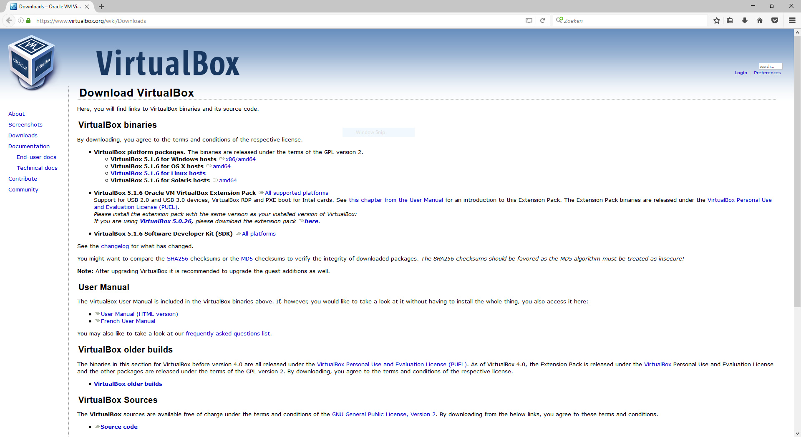
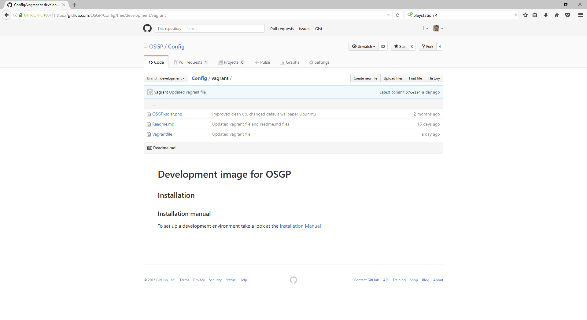
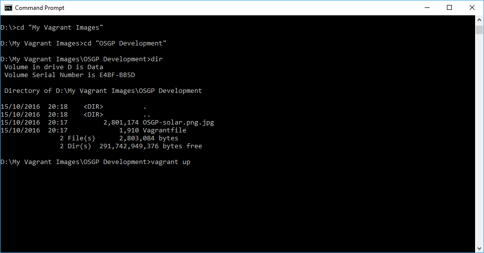
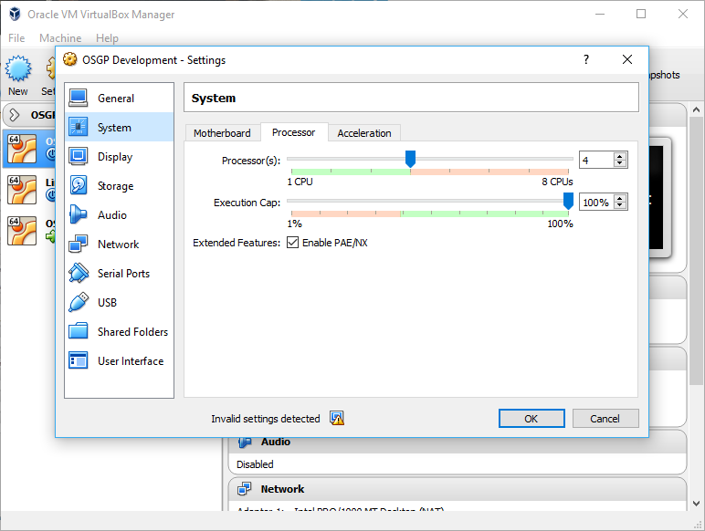

# Creating a Virtual Machine using [Virtual Box](https://www.virtualbox.org/) and [Vagrant](https://www.vagrantup.com)
To improve the usability of the Installation process, we have created a Script and Vagrant file to automatically set-up the development environment. These steps will describe how to install VirtualBox, Vagrant and kick off the procedure by running the vagrant up command.

##Install Vagrant and VirtualBox
Before we can use VirtualBox and Vagrant, we will have to install it.
Start by downloading VirtualBox by going to <https://www.virtualbox.org/wiki/Downloads>
And follow the installation steps.

Next we have to download and install Vagrant. Vagrant is available at the following URL:
<https://www.vagrantup.com/downloads.html>
Complete the installation and restart your PC.

####Tip
 - Remember to enable Virtualization in your system BIOS.
 - Also disable Hyper-V in Windows (can be found in Windows Features)

##Download and run the Vagrant file
First create a new directory (for example: `C:\OSGP\osgp-box\`)

@Todo: Must put Vagrantfile here

Browse to <https://raw.githubusercontent.com/OSGP/Config/development/vagrant/Vagrantfile> and right-click on the page and choose 'Save page as..'

@Todo: Add Screenshot of downloading the vagrant file

Navigate to your newly created directory and choose 'save'.

Now open a Command Prompt and navigate to the newly created directory where you just put the Vagrantfile.

Run the following command:
`vagrant up`

Vagrant will now automatically download an Ubuntu image, install it, and run the installation puppet script when finished. This might take a while, depending on your internet speed.
After some time (while the script is still running) you will notice that a window with an Ubuntu Virtual Machine pops-up.
Don't log in yet, wait until the script in the Console is finished.

Now that the script has been ran its course, go to the Ubuntu virtual machine and log in as vagrant user (the password is vagrant). Now shut the virtual machine down.

Once the machine has been Shut Down, open VirtualBox and right click on the new virtual machine (called osgp-box_osgp_oss_xxxxxxx) and select Settings. Go to System and increase the Base Memory of the system to at least 4096 (more is better).

Now go to the Processor Tab and increase the amount of Processors to 4.

Close the Settings window and Start the Virtual Machine again. Once it is booted, click the Cogwheel in the top-right corner of the screen and select 'The "dev" user'. Login using the password 'dev'.

####Tip
 - Remember to always log in as The "dev" user

We just created a virtual machine, running Ubuntu with pre-installed tooling. The next chapter of the guide describes how to set-up the OSGP platform.