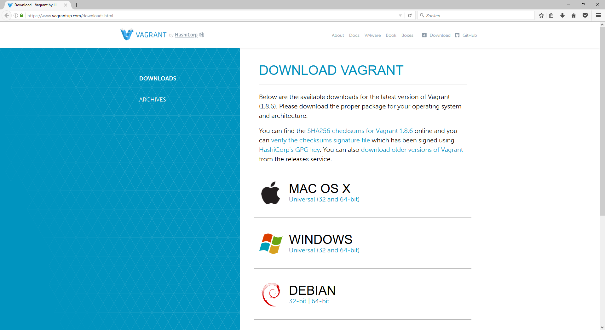
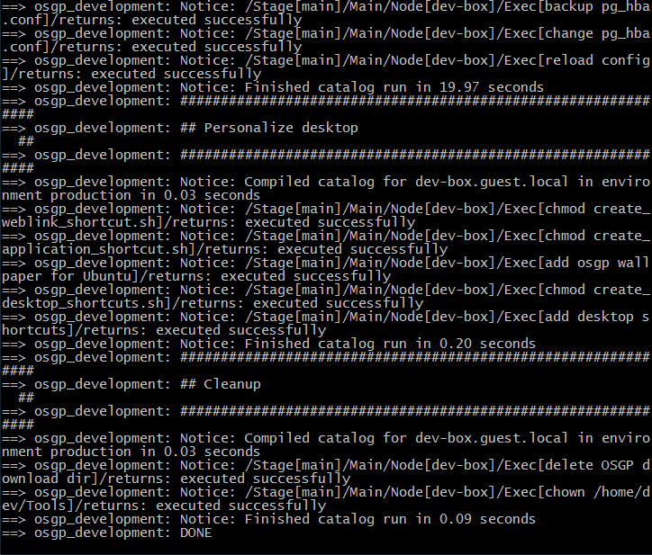
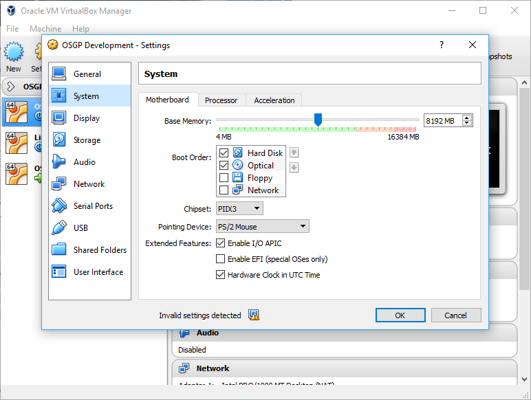

## Installation

This document describes the automatic installation procedure for your OSGP development environment.

---
### Manual installation

If you would like to follow the **manual installation procedure**, please proceed to the [Manual Installation Chapter](./manualInstallation.md).  

---

### Overview
##### Creating a Virtual Machine using [Virtual Box](https://www.virtualbox.org/) and [Vagrant](https://www.vagrantup.com)
To improve the usability of the Installation process, a Puppet Script and Vagrant file are used to automatically set-up a virtual OSGP development environment. The following steps will describe how to install VirtualBox, Vagrant and kick off the procedure by running the `vagrant up` command.


### System Requirements
The following system requirements are recommended:

- Core i5/i7 ~2.5GHz
- At least 4 GB RAM, 8 GB recommended
- At least 10 GB free space

The installation procedure has been tested on Windows 7, Windows 10, MacOS, Ubuntu 14.04 and Ubuntu 16.04.

### Install Vagrant and VirtualBox

Start by downloading VirtualBox by going to <https://www.virtualbox.org/wiki/Downloads>
And follow the installation steps. 
> **note:** If you already have VirtualBox, make sure it is at least **version 5.1.6**


> **note:** Check whether Virtualbox stores the images on a drive with enough free space. (Open Oracle VM VirtualBox Manager -> Preferences -> General -> Default Machine Folder).

Now download and install Vagrant. Vagrant is available at the following URL:
<https://www.vagrantup.com/downloads.html>
> **note:** If you already have Vagrant, make sure it is at least **version 1.8.6**
Complete the installation and restart your PC.


> **note:** If you did a fresh install of Vagrant and already had a command prompt open, make sure you close this command prompt and open it again.

#### Tip
 - Remember to enable Virtualization in your system BIOS.
 - Also disable Hyper-V in Windows (can be found in Windows Features)

## Download and run the Vagrant file
First create a new directory (for example: `D:\My Vagrant Images\OSGP Development\`)

Browse to <https://raw.githubusercontent.com/OSGP/Config/development/vagrant> and save the png image and Vagrantfile files in your newly created directory.


#### Note
 - Make sure that the file is named like this: `Vagrantfile`  *without* an extension!
 - If the file has an extension (for example .txt) you can rename the file using the following console command.
MacOS/Linux:
```shell
mv Vagrantfile.txt Vagrantfile
```
Windows:
```shell
move Vagrantfile.txt Vagrantfile
```

Now open a Command Prompt and navigate to the newly created directory where you just put the files.

Run the following command:
`vagrant up`


Vagrant will now automatically download an Ubuntu image (+- 2.6 Gb), install it, and run the installation puppet script when finished. This might take a while, depending on your internet speed.
After some time (while the script is still running) you will notice that a window with an Ubuntu Virtual Machine pops-up.
Don't log in yet, wait until the script in the Console is finished.



#### Tip
 - If the script fails for some reason (eg. Errors in the console such as time outs during downloading), you can retry the procedure by running the following command `vagrant destroy && vagrant up`

Now that the script has ran its course, go to the Ubuntu virtual machine and log in as 'The "dev" user', when asked for a password, enter 'dev'. Now shut down the virtual machine.


Once the machine has been Shut Down, open VirtualBox and right click on the new virtual machine (called xxxx_xxxx_osgp_development_xxxxxxx) and select Settings. Go to System and increase the Base Memory of the system to at least 4096 mb (or the maximum recommended (in green amount).



Now go to the Processor Tab and increase the amount of Processors to the maximum recommended (in green) amount.


Close the Settings window and Start the Virtual Machine again. Once it is booted, you should be automatically logged in as the 'Dev' user.

You just created a virtual machine running Ubuntu with pre-installed tooling. The next chapter of the guide describes how to set-up the open smart grid platform.
