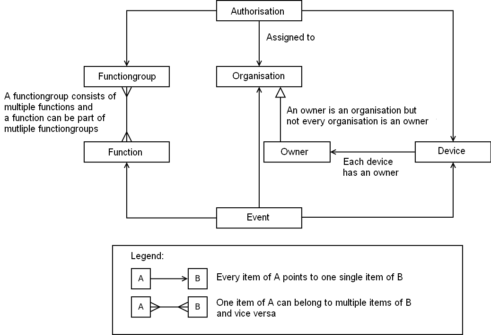

## 1.3 Logical Data Model

This model displays the most important entities of the OSGP system and their mutual relationships.

_Image 4, Logical Data Model_
 

The logic of the model above:

At the top of the image is the entity "authorisation". This represents the permissions of an organization on a certain device. In general an organisation will have a lot of permissions, at least one for each device it needs to manage.

The functions an organisation can execute on a device are determined by the function group the authorisation refers to. Function groups are collections of functions and are predefined in the software. The following function groups have been predefined.

- Owner-group (this contains all functions)
- Ad hoc-group (Functions for ad hoc switching of lighting)
- Management-group (Platform functions)
- Installation-group (Functions to install devices)
- Firmware-group (Functions for updating firmware)
- Schedule-group (Functions to create lighting schedules)
- Tariff scheme-group (Functions to create tariff groups)
- Configuration-group (Functions to configure devices)
- Monitoring-group (Functions to monitor devices)

This structure provides maximum flexibility when assigning rights to devices. Devices always belong to an Owner. An organisation can be an owner. The entity "Event", at the bottom of the image, is the execution of a function by an organisation on a device.

Details like device-type, device-status etcetera have been omitted in this model.

One security requirement is that each event must be traced back to a 'natural'  person, also known as an audit trail. Although OSGP does not register individual users we can meet this requirement by registering a data-item with each event. This enables the user organisation to investigate which events belongs to which 'natural' person. This data-item can for example be an user-ID provided by the user-organisation which doesn't have to be unique in the OSGP platform.

Table describing the entities in the logical data-model

| **Entity** | **Description** |
| --- | --- |
| authorisation | Authorisation – Permissions of an organisation to execute a certain function  (member of a role) on a certain device |
| device | Electronics present in a "container" (for example a lamp post), connecting to the OSGP platform and (in case of a lamp post) controls the lights. One device has one owner. |
| audit trail | The actions of an organisation on a device. A combination of [time, organisation, function and device]. |
| function | An end-to-end operation. For example "set schedule". A function belongs to multiple function groups. |
| function group | Usually this will be larger groups than the "function clusters" in this document. All functions available to end users could be in a single group for example. |
| organisation | Een partij die een rol speelt in het beheer en de aansturing van de devices. Bijvoorbeeld: Liander, gemeenten. A party playing a role in the management and control of the devices. |
| owner | An organisation role. Each device has an owner. |
| event | An event reported by the device (which is not the action of a natural person) for example an error or security problem. |
