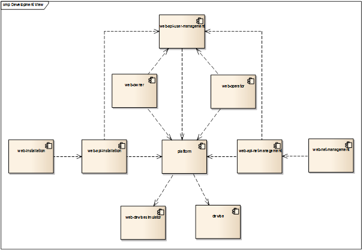
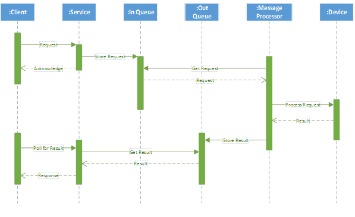

## 1.6 Models and Views

### 1.6.1 Design view

The image below shows a high-level view of the system's components.

### 1.6.2 Data model platform

_Image, Overview of platform data model_

Data model explanation:

| **Table** | **Description** |
| --- | --- |
| devices | Devices table |
| device\_authorisation | Authorisation table, function group column concerns the device functions (AD\_HOC, INSTALLATION, etc) |
| organisation | Organisation table, function group column concerns the platform functions (ADMIN of USER) |
| event | Events table |
| oslp\_log\_item | Table for logging of OSLP messages. |
| webservice monitor log item | Audit record for tracking webservice activity. |

### 1.6.3 Data model web application

_Image showing the datamodel for the owners and management application_

Data model explanation:

| **Table** | **Description** |
| --- | --- |
| devices | Devices tabel |
| organisations | Organisation table with userinfo. |
| lightmeasurementdevices | Light measurement table for linking to devices and conversion to transitions (via sms\_type and sms\_index) of incoming light measurement texts. |
| groups | Device groups. Device can exist only in 0 or 1 group. |
| Lighting schedule | Available lighting schedules linked to device (after upload of schedule). |
| Tariff schedule | Available tariff schedules linked to device (after upload of schedule). |
| Keyvalue settings | Key/value pairing to store dynamic configuration. Organisations have their own configuration. |
| Burninghour reports | Monthly Burninghour reports |
| Burninghour report devices | Device informatie burninghour report |
| Burninghour report data | Data related to a device in burninghour report. |

### 1.6.4 Logical view

The logical view is a high-level overview of the system . The image below displays the main components and interfaces between these components.

 

This Table presents an overview of the components and the most important technological choices per component.

| **Component** | **Technologieën** |
| --- | --- |
| OSGP Platform | Java, Spring Framework, Hibernate, Netty |
| Demo applicatie | Java, Spring Framework, Spring MVC |
| OSGP Management applicatie | Java, Spring Framework, Spring MVC |
| Net-Management applicatie | Java, Spring Framework, JAX-RS, AngularJS |
| Liander Installatie applicatie | Java, Spring Framework, JAX-RS, AngularJS |
| Web services | SOAP, WSDL |
| OSLP Protocol | Google Protocol Buffers |

### 1.6.5 Interface view

The platform contains  2 kinds of external interfaces:

1. Web services (WSDL), to provide platform functionality to 3rd party applications.
2. Open Street Light Protocol (OSLP), to communicate with devices.

### 1.6.6 Web Services (WSDL)

A separate WSDL is implemented for each functional cluster. All SOAP operations have a request object parameter and return a response object. For Synchronized Webservices  the result is immediately included in the response.

For asynchronous web services the response contains a correlation ID. This Correlation ID  is to be used by the requester to receive the actual result from the platform. The following diagram is an example of such an asynchronous request.

Furthermore each SOAP message has a header which contains the user's organisation ID. This table displays an overview of the WSDL's including operations and fields in the request and response objects.

| **Operation** | **Request** | **Response** |
| --- | --- | --- |
| **Common** |
| **DeviceInstallation.wsdl** |
| AddDevice | DeviceIdentification | - |
| FindDevicesWhichHaveNoOwner | - | Devices |
| FindRecentDevices | - | Devices |
| StartDeviceTest | DeviceIdentification | - |
| StopDeviceTest | DeviceIdentification | - |
| UpdateDevice | DeviceIdentification | - |
| GetStatus | DeviceIdentification | Status |
| **DeviceManagement.wsdl** |
| ChangeOrganisation | Organisation | - |
| CreateOrganisation | Organisation | - |
| FindAllOrganisations | - | Organisations |
| FindDeviceAuthorisations | DeviceIdentification | DeviceAuthorisations |
| FindDevices | PageSize, Page | Devices, Page |
| FindEvents | DeviceIdentification, From, Until, PageSize, Page | Events, Page |
| FindMessageLogs | DeviceIdentification, Page | MessageLogPage |
| RemoveDevice | DeviceIdentification | - |
| RemoveOrganisation | Organisation |   |
| SetEventNotifications | DeviceIdentification, EventNotifications | - |
| SetOwner | DeviceIdentification, OrganisationIdentification | - |
| UpdateDeviceAuthorisations | DeviceAuthorisations | - |
| ActivateOrganisation | Organisation | - |
| **FirmwareManagement.wsdl** |
| GetFirmwareVersion | DeviceIdentification | FirmwareVersion |
| UpdateFirmware | DeviceIdentification, FirmwareIdentification | - |
| **ConfigurationManagement.wsdl** |
| GetConfiguration | DeviceIdentification | Configuration |
| SetConfiguration | DeviceIdentification, Configuration | - |
| **ScheduleManagement.wsdl** |
| SetSchedule | DeviceIdentification, Schedules, Page | - |
| SetTariffSchedule | DeviceIdentification, Schedules, Page | - |
| ** AdHocManagement.wsdl       ** |
| SetReboot | DeviceIdentification | - |
| **PublicLighting** |
| **DeviceMonitoring.wsdl** |
| GetActualPowerUsage | DeviceIdentification | PowerUsageData |
| GetPowerUsageHistory | DeviceIdentification, TimePeriod, HistoryTermType, Page | PowerUsageData, PageInfo |
| **PublicLightingAdHocManagement** |
| SetTransition | DeviceIdentification, TransitionType, Time | - |
| FindAllDevices | Page | DevicePage |
| GetStatus | DeviceIdentification | LightValues, PreferredLinkType, ActualLinkType, LightType, EventNotifications |
| ResumeSchedule | DeviceIdentification, Index, IsImmediate | - |
| SetLight | DeviceIdentification, LightValue | - |
| **PublicLightingScheduleManagement** |
| SetSchedule | DeviceIdentification, Schedules, Page | - |
| **TariffSwitching** |
| **TariffSwitchingAdHocManagement** |
| GetDevices |   |   |
| GetStatus | DeviceIdentification | Status |
| **TariffSwitchingScheduleManagement** |
| SetSchedule | DeviceIdentification, Schedules, Page | - |

### 1.6.7 Technology selection

Open street light protocol does not use ASN.1 but Google Protocol Buffers. The main reason for this is the lack of a good quality free compiler for Java or C.

Open LDAP is not applied. A database solution was chosen instead of Directory services for authorisation.
